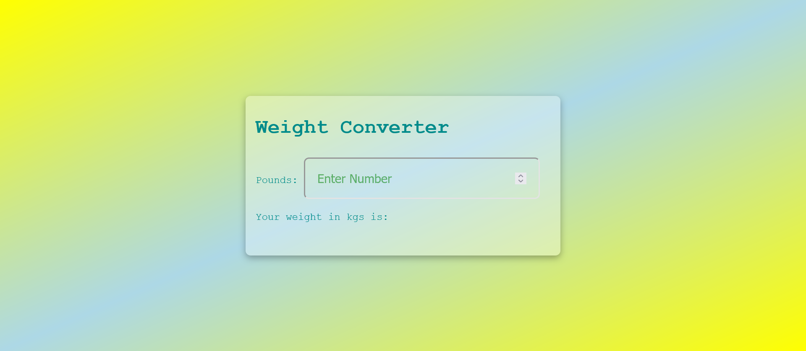

Welcome 👋🏽🫂

## Intro
This is one of the many projetcs from [100jsprojects](https://www.100jsprojects.com/project/weight-converter)

# Project description

A weight converter project that converts pounds to kilograms. The webpage features an input field where users can enter weight in pounds, and the webpage automatically displays the equivalent weight in kilograms. After 10 seconds, the result is removed, and the input field is emptied using the 'set time out' method. We've also incorporated an error handling feature to handle negative input numbers. If the user enters a negative number, the webpage displays an error message, "Please enter a valid number!" 

# Resources i used
- ChatGPT 

Live [site](https://dice-roll-simulator.onrender.com)

If you have insights on where i can improve or you want to connect with me feel free to do so 
👉🏽 [here](https://twitter.com/vykiddeh_)

Coded with ❤️ by Viki Wainaina

Enjoy building 🚀🚀